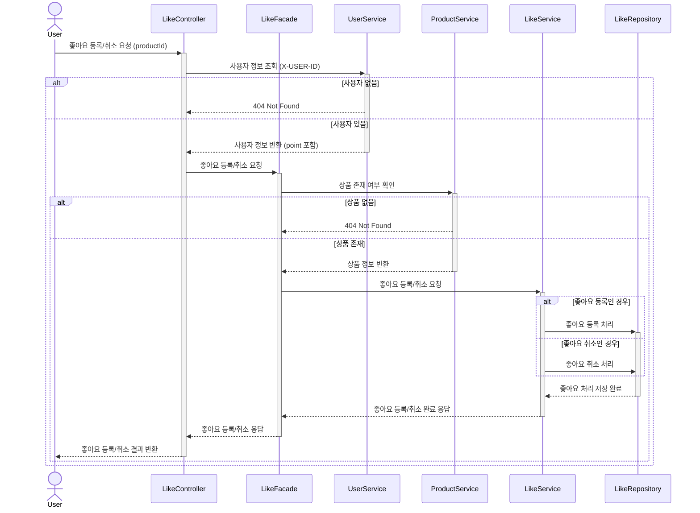
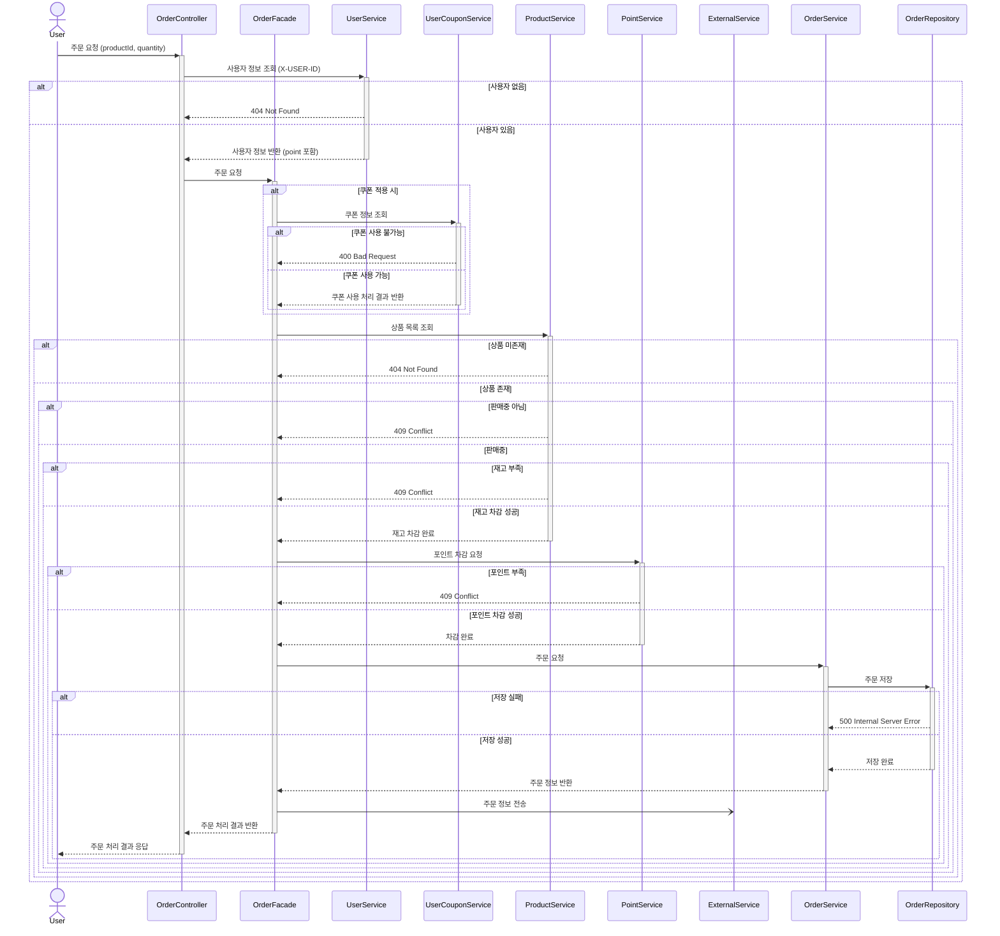

# 02. 시퀀스 다이어그램

## 좋아요 등록/취소

```mermaid
sequenceDiagram
    actor U as User
    participant LC as LikeController
    participant LF as LikeFacade
    participant US as UserService
    participant PS as ProductService
    participant LS as LikeService
    participant LR as LikeRepository

    U ->>+ LC: 좋아요 등록/취소 요청 (productId)
    LC ->>+ US: 사용자 정보 조회 (X-USER-ID)

    alt 사용자 없음
        US -->> LC: 404 Not Found
    else 사용자 있음
        US -->>- LC: 사용자 정보 반환 (point 포함)
        LC ->>+ LF: 좋아요 등록/취소 요청
        LF ->>+ PS: 상품 존재 여부 확인
        
        alt 상품 없음
            PS -->> LF: 404 Not Found
        else 상품 존재
            PS -->>- LF: 상품 정보 반환
            LF ->>+ LS: 좋아요 등록/취소 요청
            
            alt 좋아요 등록인 경우
                LS ->>+ LR: 좋아요 등록 처리
            else 좋아요 취소인 경우
                LS ->> LR: 좋아요 취소 처리
            end
            LR -->>- LS: 좋아요 처리 저장 완료
            LS -->>- LF: 좋아요 등록/취소 완료 응답
            LF -->>- LC: 좋아요 등록/취소 응답
            LC -->>- U: 좋아요 등록/취소 결과 반환
        end
    end
```

## 주문 & 결제

```mermaid
sequenceDiagram
    actor U as User
    participant OC as OrderController
    participant OF as OrderFacade
    participant US as UserService
    participant CS as UserCouponService
    participant PS as ProductService
    participant PTS as PointService
    participant ES as ExternalService
    participant OS as OrderService
    participant OR as OrderRepository

    U ->>+ OC: 주문 요청 (productId, quantity)
    OC ->>+ US: 사용자 정보 조회 (X-USER-ID)

    alt 사용자 없음
        US -->> OC: 404 Not Found
    else 사용자 있음
        US -->>- OC: 사용자 정보 반환 (point 포함)
        OC ->>+ OF: 주문 요청
        
        alt 쿠폰 적용 시
            OF ->>+ CS: 쿠폰 정보 조회
            
            alt 쿠폰 사용 불가능
                CS -->> OF: 400 Bad Request
            else 쿠폰 사용 가능
                CS -->>- OF: 쿠폰 사용 처리 결과 반환
            end
        end
        
        OF ->>+ PS: 상품 목록 조회

        alt 상품 미존재
            PS -->> OF: 404 Not Found
        else 상품 존재
            alt 판매중 아님
                PS -->> OF: 409 Conflict
            else 판매중
                alt 재고 부족
                    PS -->> OF: 409 Conflict
                else 재고 차감 성공
                    PS -->>- OF: 재고 차감 완료
                    OF ->>+ PTS: 포인트 차감 요청

                    alt 포인트 부족
                        PTS -->> OF: 409 Conflict
                    else 포인트 차감 성공
                        PTS -->>- OF: 차감 완료
                        OF ->>+ OS: 주문 요청
                        OS ->>+ OR: 주문 저장

                        alt 저장 실패
                            OR -->> OS: 500 Internal Server Error
                        else 저장 성공
                            OR -->>- OS: 저장 완료
                            OS -->>- OF: 주문 정보 반환
                            OF -) ES: 주문 정보 전송
                            OF -->>- OC: 주문 처리 결과 반환
                            OC -->>- U: 주문 처리 결과 응답
                        end
                    end
                end
            end
        end
    end
```
