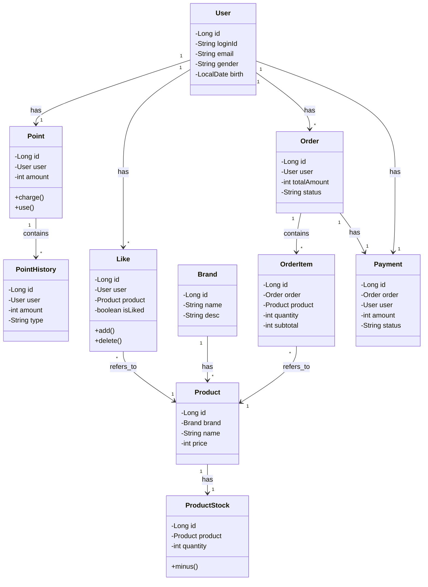

# 03. 클래스 다이어그램

```mermaid
classDiagram
    class User {
        -Long id
        -String loginId
        -String email
        -String gender
        -LocalDate birth
    }
    
    class Point {
        -Long id
        -User user
        -int amount
        
        +charge()
        +use()
    }
    
    class PointHistory {
        -Long id
        -User user
        -int amount
        -String type
    }
    
    class Like {
        -Long id
        -User user
        -Product product
        -boolean isLiked
        
        +add()
        +delete()
    }
    
    class Brand {
        -Long id
        -String name
        -String desc
    }
    
    class Product {
        -Long id
        -Brand brand
        -String name
        -int price
    }
    
    class ProductStock {
        -Long id
        -Product product
        -int quantity
        
        +minus()
    }
    
    class Order {
        -Long id
        -User user
        -int totalAmount
        -String status
    }
    
    class OrderItem {
        -Long id
        -Order order
        -Product product
        -int quantity
        -int subtotal
    }
    
    class Payment {
        -Long id
        -Order order
        -User user
        -int amount
        -String status
    }
    
    %% 관계
    User "1" --> "1" Point : has
    Point "1" --> "*" PointHistory : contains
    User "1" --> "*" Like : has
    Like "*" --> "1" Product : refers_to
    Brand "1" --> "*" Product : has
    Product "1" --> "1" ProductStock : has
    User "1" --> "*" Order : has
    Order "1" --> "*" OrderItem : contains
    OrderItem "*" --> "1" Product : refers_to
    Order "1" --> "1" Payment : has
    User "1" --> "1" Payment : has

```
