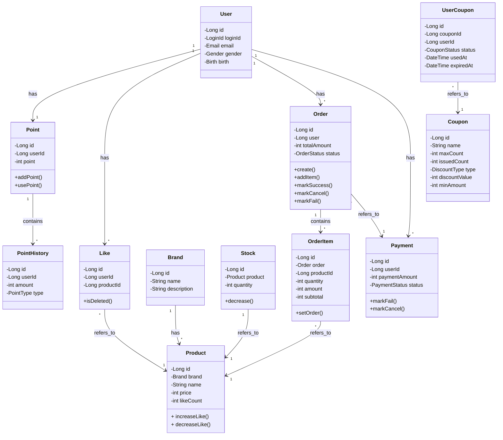

# 03. 클래스 다이어그램

```mermaid
classDiagram
    class User {
        -Long id
        -LoginId loginId
        -Email email
        -Gender gender
        -Birth birth
    }
    
    class Point {
        -Long id
        -Long userId
        -int point
        
        +addPoint()
        +usePoint()
    }
    
    class PointHistory {
        -Long id
        -Long userId
        -int amount
        -PointType type
    }
    
    class Like {
        -Long id
        -Long userId
        -Long productId
        
        +isDeleted()
    }
    
    class Brand {
        -Long id
        -String name
        -String description
    }
    
    class Product {
        -Long id
        -Brand brand
        -String name
        -int price
        -int likeCount
        
        + increaseLike()
        + decreaseLike()
    }
    
    class Stock {
        -Long id
        -Product product
        -int quantity
        
        +decrease()
    }
    
    class Order {
        -Long id
        -Long user
        -int totalAmount
        -OrderStatus status
        
        +create()
        +addItem()
        +markSuccess()
        +markCancel()
        +markFail()
    }
    
    class OrderItem {
        -Long id
        -Order order
        -Long productId
        -int quantity
        -int amount
        -int subtotal
        
        +setOrder()
    }
    
    class Payment {
        -Long id
        -Long userId
        -int paymentAmount
        -PaymentStatus status
        
        +markFail()
        +markCancel()
    }
    
    class Coupon {
        -Long id
        -String name
        -int maxCount
        -int issuedCount
        -DiscountType type
        -int discountValue
        -int minAmount
    }
    
    class UserCoupon {
        -Long id
        -Long couponId
        -Long userId
        -CouponStatus status
        -DateTime usedAt
        -DateTime expiredAt        
    }
    
    %% 관계
    User "1" --> "1" Point : has
    Point "1" --> "*" PointHistory : contains
    User "1" --> "*" Like : has
    Like "*" --> "1" Product : refers_to
    Brand "1" --> "*" Product : has
    Stock "1" --> "1" Product : refers_to
    User "1" --> "*" Order : has
    Order "1" --> "*" OrderItem : contains
    OrderItem "*" --> "1" Product : refers_to
    Order "1" --> "1" Payment : refers_to
    User "1" --> "*" Payment : has
    UserCoupon "*" --> "1" Coupon : refers_to

```
