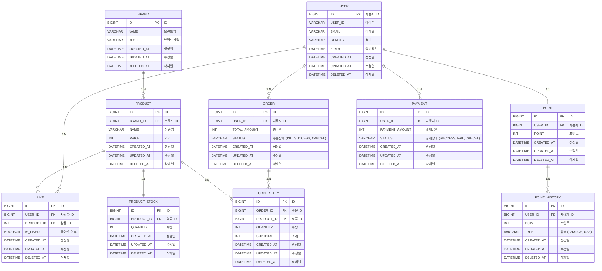

# 04. ERD

### 데이터 목록
- **USER**:  사용자
- **POINT**: 포인트
- **POINT_HISTORY**: 포인트 이력
- **LIKE**: 좋아요
- **BRAND**: 브랜드
- **PRODUCT**: 상품
- **PRODUCT_STOCK**: 재고
- **ORDER**: 주문
- **ORDER_ITEM**: 주문 상세
- **PAYMENT**: 결제

### ERD

